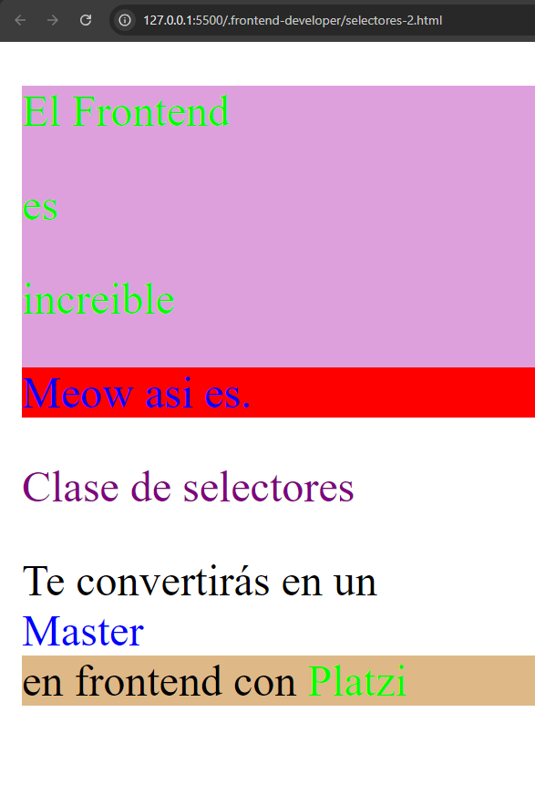

## 3. Selectores combinadores.

Es posible combinar los selectores para agregar estilos de manera mas especifica, existen distintos tipos:

<br>

|  |  |
| :---: | :---: |
| Descendientes | div p |
| Hijo directo | div > p |
| Elemento adyacente | div + p |
| General de hermanos | div ~ p |

<br>

- **Descendientes**: Todos los elementos de un solo tipo contenidos en otro se modificarán, se escribe el `elemento padre`, `espacio`, y el `elemento descendiente` que será de manera general, en el ejemplo de abajo, todas las etiquetas p, tendrán letras de color rojo.
  
  <br>

  ```css
  div p {
    color: red;
  }
  ```
  ```html
  <div>
    <p>letras color rojo</p>
    <p>letras color rojo</p>
    <p>letras color rojo</p>
  </div>
  ```

<br>
<br>

- **Hijo directo**: El elemento hijo que esta justo por debajo del elemento padre será modificado, se escribe el `elemento padre` seguido de un signo de **mayor que** `(>)` y el `elemento hijo directo`. En el ejemplo tenemos 3 div anidados el div hijo que esta justo por debajo del div padre es el que tendrá el background de color azul.
  
  <br>

  ```css
  div > div {
    background: blue;
  }
  ```
  ```html
  <div>
        <div>
            <p>Aquí todo el div padre</p>
            <p>tendrá un background</p>
            <p>de color azul</p>
            <div class="es">Meow asi es.</div>
        </div>
    </div>
  ```

  <br>
  <br>

- **Elemento adyacente**: Será modificado el `elemento que este junto` al `elemento que escribamos primero` en el selector, en medio de estos dos escribiremos el **signo de mas** `(+)`. En el siguiente ejemplo todos los elementos **section** que esten seguidos de un elemnto **div** tendrán el background verde:
    
  <br>

  ```css
  div + section {
    color: green;
  }
  ```
  ```html
  <div>
    <p></p>
  </div>
  <section> Esta sección tendrá el background de color verde </section>
  <div>
    <p></p>
  </div>
  <section> Esta sección también tendrá el background de color verde</section>
  <footer></footer>
  ```

  <br>
  <br>

- **Elemento General de hermanos**: modifica a los `hermandos del primer selector escrito`, en medio de estos se escribe una **virgulilla** `(~)`. En este ejemplo, todos los hermanos p de div se les aplicará un color de letra purpura.
  
  <br>

  ```css
  div ~ p {
    color: purple;
  }
  ```
  ```html
  <div>
    <div></div>
    <p>Todos</p>
    <p>estos</p>
    <p>parrafos</p>
    <p>tendrán</p>
    <p>la letra</p>
    <p>purpura</p>
  </div>
  ```

<br>

### Maquetación de selectores combinatorios:

```html
<!DOCTYPE html>
<html lang="en">
<head>
    <meta charset="UTF-8">
    <meta name="viewport" content="width=device-width, initial-scale=1.0">
    <title>Document</title>
    <style>
        div p {
            color: lime;
        }
        div > div {
            background: plum;
        }
        .es{
            background: red;
        }
        div + section {
            background: burlywood;
        }
        div ~ p {
            color: purple;
        }
        p ~ div {
            color: blue;
        }
        section > span {
            color: lime;
        }
    </style>
</head>
<body>
    <div>
        <div>
            <p>El Frontend</p>
            <p>es</p>
            <p>increible</p>
            <div class="es">Meow asi es.</div>
        </div>
    </div>
    <p>Clase de selectores</p>
    <section>
        Te convertirás en un
    </section> 
    <div>
        Master
    </div> 
    <section>
        en frontend con <span>Platzi</span>
    </section>  
</body>
</html>
```

<br>

En el navegador se vería así:

