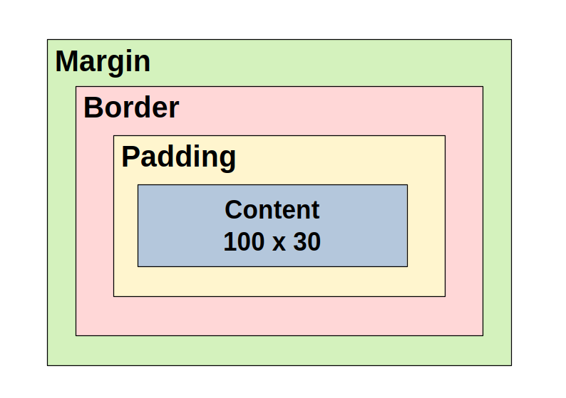
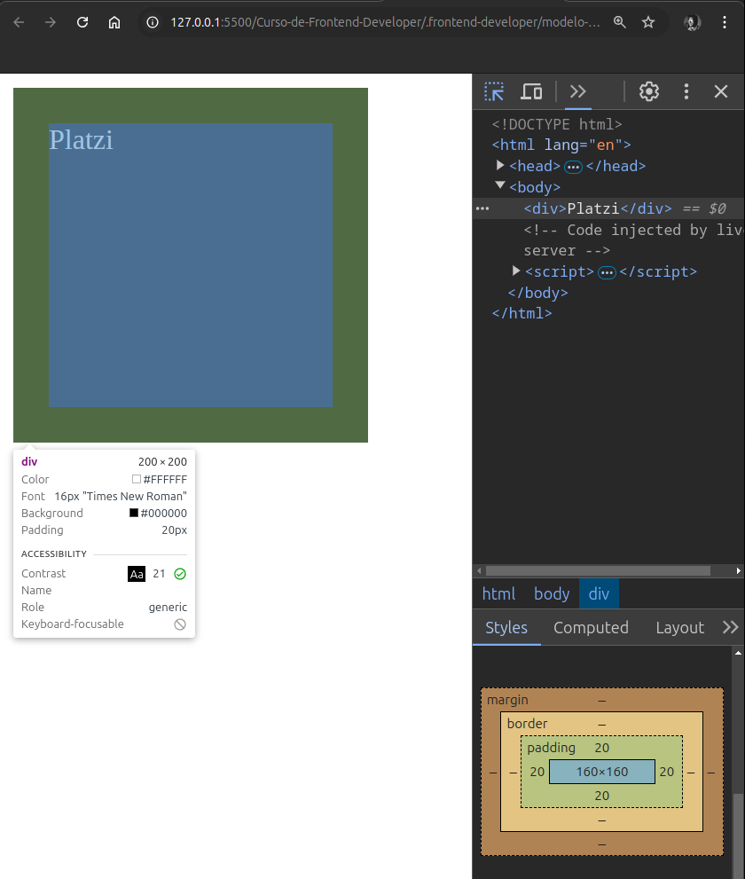

# Modelo de caja

En clases anteriores vimos que cada una de nuestras etiquetas son representadas como cajas, de las cuales, cada una tiene un tipo de visualización, ya sea de bloque, en línea o un híbrido de estas dos.

Todas estas cajas tienes estas propiedades



 **Content**: es el contenido, al que le podemos agregar el width y el height
 **Padding**: es un margen interno 
 **Border**: borde pro fuera
 **Margin**:un margen externo

 En este ejemplo se le agrega un padding de 20px a un div de 200px * 200px, el padding se suma al tamaño del div, par mantener el tamaño de la caja podemos usar la propiedad `box-sizing: border-box` 

 ```css
 <style>
        div {
            width: 200px;
            height: 200px;
            background: black;
            color: white;
            padding: 20px;
            box-sizing: border-box;
        }
</style>
 ```

<br>

 Antes de declarar la propiedad, la caja se vería así:

<br>

 

 <br>

 Después de agregar la propiedad:

 

 Agregamos un borde y cambiamos las dimensiones de la caja para observar algo interesante:

 

Como se observa en la imagen los dos margenes de los div se solapan.