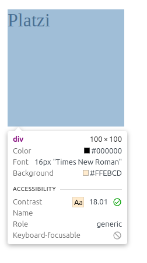

# Unidades de medidas.

Tenemos dos tipos de medidas, absolutas y relativas  

Las absolutas son las que no dependen de nada para permanecer tal cual son, siempre y cuando se mantenga en la misma resolución de zoom de 100%

Las relativas son las que si dependen de algo más.
Absolutas | Relativas
:---: | :---:
Pixeles (px) | Porcentajes (%)
Puntos (pt) | (rem)
Picas (pc) | (em)
Pulgadas (in) | View-Width (vw)
Centímetros (cm) | View-min (vmin)
Milímetros (mm) | View-max (vmax)
| |               (ex) |
| |               (ch)|


### rem

La unidad de medida relativa rem equivale a un porcentaje del tamaño de fuente predeterminado que tiene el documento de html que es de 16 pixeles, cada aumento en la medida de rem equivale a el doble de la medida de la fuente por defecto de html.

Aquí tenemos este div con `font-size` de `1rem` el cual es equivalente al tamaño de fuente predeterminado que es de 16px.



Al aumentar el tamaño a `2rem` tendremos como resultado el doble que es 32px:


Pero para hacer otros cálculos esta medida se nos va a complicar un poco, por lo que le diremos al html que convierta esos 16px en 10px para poder manejar los tamaños en relación de décimas.  
Por lo cual tendremos que hacer una regla de 3:

100% = 16px  
? = 10px

$100 * 10 / 16 = 62.5$


El código sería así:

```html
<html>
    <head>
    <style>
            html {
                font-size: 62.5%;
            }
            div {
                width: 100px;
                height: 100px;
                background: blanchedalmond;
                font-size: 2rem;
            }
            p {
                font-size: 1rem;
            }
        </style>
    </head>
    <body>
        <div>Platzi</div>
        <p>Master</p>
    </body>
</html>
```

<br>
<br>

### View-width (vw) y View-height (vh)

Estas unidades de medida, modifican el tamaño en relación al 1% del tamaño del viewport actual.
 
 <br>

 > Nota: el **viewport** es el tamaño actual de la ventana de visualización del contenido de una pagina html en el navegador web.

 Entonces tendremos que si la ventana de visualización del contenido web del navegador es de 1000px de ancho o de alto, el view-width/height 1vw y 1vh respectivamente, el ancho y el alto serían de 10px