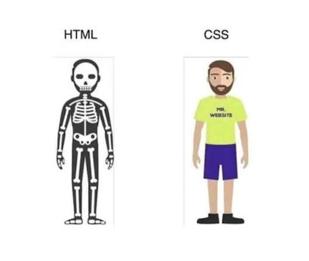
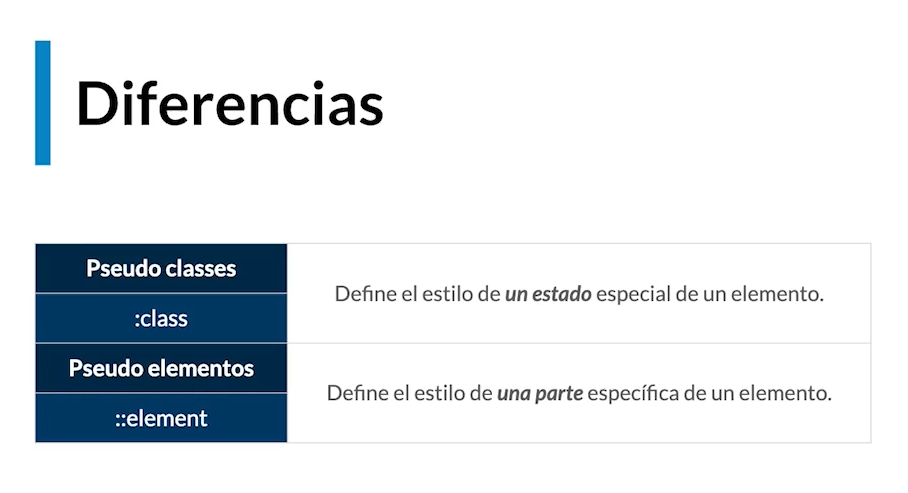

# CSS

CSS significa Cascading Style Sheets, es la tecnología o estándar que utilizaremos para estilizar y darle un orden en pantalla a nuestros proyectos. HTML es el contenido, la estructura o se podría considerar como el "esqueleto" de los sitios web, mientras que CSS sería el recubrimiento o siguiendo la analogía de un cuerpo humano la "piel" que cubre ese esqueleto o estructura de html.

<br>



<br>

## Anatomía de una regla de CSS

<br>


<br>

## Formas de aplicar estilos

Existen tres formas de aplicar los estilos al fichero html:

1. Como atributo en la etiqueta a estilizar denominado embebido: `<p style="font-size: 50px"> Texto </p>`
2. Dentro de la etiqueta `head`:
   
   ```html
   <head>
        <style>
            p {
                font-size: 50px;
            }
        </style>
    </head>
    <body>
        <p>Texto</p>
    </body>
   ```
3. Con un fichero aparte con extensión css referenciando su ruta dentro de la etiqueta `head`:
   
   ```css
   p {                                                               /* FICHERO .css */
    font-size: 50px;
   }
   ```
   ```html
   <head>                                                          <!-- FICHERO .html -->
        <link rel="stylesheet" href="./ruta/style.css">
    </head>
    <body>
        <p>Texto</p>
    </body>
   ```

<br>

> **NOTA**: Cuando tengamos varias paginas html, la inicial siempre sera index.html, para aplicar estilos, dependiendo de la forma en la que esté construido el sitio web, podemos generar un fichero css para cada pagina, y lo mas importante, que sus nombres coincidan y estén bien referenciados, para no tener problemas en los estilos y en ediciones posteriores.

<br>

## Selectores

### Básicos
Los selectores son formas más especificas de denominar al elemento que vamos a estilizar en el fichero css, existen tres selectores básicos.

1. Por etiqueta: que es el que hemos estado utilizando y es el menos específico:
   
   ```css
   p {
    text-align: center;
   }
   ```
2. Por clase, que es la siguiente en especificidad, y se debe de colocar el atributo class seguido del nombre que queramos colocar, después para llamarlo en css, se escribe un punto antes del nombre de la clase.
   
   ```html
   <!-- html -->
   <p class="parrafo">Texto</p>
   ```
   ```css
   /* css */
    .parrafo {
        font-size: 50px;
    }
   ```

3. Por id, y la sintaxis seria la misma que en las clases pero en html en vez de class se escribe id seguido del nombre que queramos colocar, y en el css inicia con un "gato" (hashtag, almohadilla, numeral):
   
   ```html
   <!-- html -->
   <p id="parrafo">Texto</p>   

   ```
   ```css
   #parrafo {
    font-size: 50px;
   }
   ```

<br>


> NOTA: Hay estandares opcionales para poder nombrar las clases y los IDs, no es obligatorio pero le da una consistencia al formato y nos ayuda a tener mas rendimiento a la hora de crear las reglas css. Se le conoce como BEM (Block-Element-Modifier) Pudes ver más sobre esta forma aquí ---> [BEM](https://en.bem.info/methodology/faq/#why-bem)


<br>

### Pseudo-clases y Pseudo-elementos

Estos selectores se ocupan para modificar un estado especial o una parte especifica de un elemento.  

- Las **Pseudo-clases** inician con dos puntos `:` seguido del nombre, y se colocan al final del selector que modificaremos.
- Los **Pseudo-elementos** inician con doble dos puntos `::` seguido del nombre, y se colocan al final del selector que modificaremos.

<br>



```css
/* css */
.main-nav {
    margin-top: 10px;
    list-style: none;
    padding-left: 0;
    background: cornflowerblue;
    border-radius: 3px;
}
.main-nav__item {
    display: inline-block;
}
.main-nav__item a {
    color: white;
    padding: 5px;
    text-decoration: none;
}
.main-nav__item a:hover {  /* la  :hover */
    color: aquamarine;
}
.main-nav__item a:active {
    color: red;
}
.main-nav__item a::after {
    content: " | ";
}
```

```html
<!-- html -->
<ul class="main-nav">
    <li class="main-nav__item"><a href="#">Home</a></li>
    <li class="main-nav__item"><a href="#">Cursos</a></li>
    <li class="main-nav__item"><a href="#">Instructores</a></li>
    <li class="main-nav__item"><a href="#">Blog</a></li>
</ul>
```

<br>

Este es el resultado del código anterior, la pseudo-clase :hover cambia el color del texto cuando el cursor pasa sobre él, y el pseudo-elemento  


[Referencia MDN pseudo-classes](https://developer.mozilla.org/es/docs/Web/CSS/Pseudo-classes)  
[Referencia MDN pseudo-elements](https://developer.mozilla.org/es/docs/Web/CSS/Pseudo-elements)

<br>

#### Aprotes de compañeros.

<br>

 