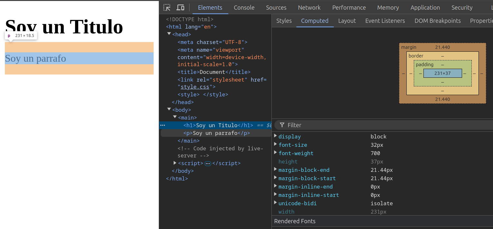
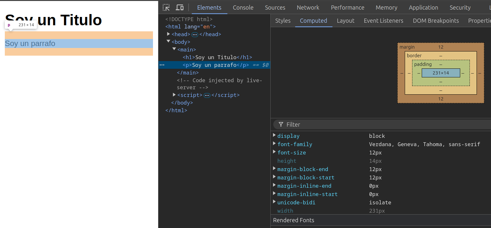
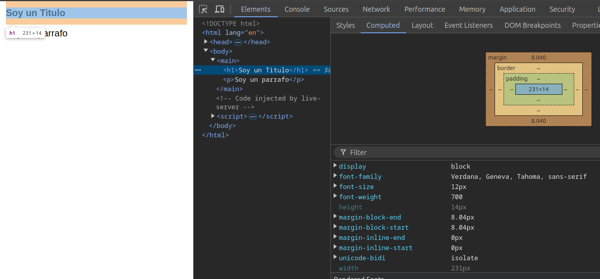

# Herencia.

Si nosotros abrimos un fichero html sin estilo alguno, es decir que no se le ha aplicado ninguna regla css, veremos en el inspector del navegar que por defecto, ya trae ciertas reglas que nosotros sabemos que no hemos aplicado, estas reglas se añadena a la etiqueta html como una forma de aplicar estilo a un fichero que no tienen ninguno relacionado de ninguna forma, sea con fichero externo de css, con etiqueta style o como atributo directo.

<br>



<br>

Como vemos en esta screenshot, nuestro elemento p tiene varias reglas aplicadas: font size de 32px, font-weight de 700, display en block, etc.

Esto es debido a la herencia, esta caracteristica, aplica estilos a todos aquellos elementos que no tienen un estilo aplicado por el desarrollador.

Aplicando un estilo diferente a la etiqueta HTML, veremos el cambio en las demás

```css
html {
        font-size: 75%;
        font-family: Verdana, Geneva, Tahoma, sans-serif;
       }
```

<br>



<br>

Hay etiquetas que tienen un estilo predefinido por el navegador sin tener que estar declarado en la etiqueta html, es el caso de h1, la cual es etiqueta de titulo, ésta no ha tomado el tamaño que hemos aplicado a la etiqueta html, solo la familia de fuente.  
Para poder aplicar el tamaño podemos utilizar la propiedad inherit.

<br>

```css
html {
        font-size: 75%;
        font-family: Verdana, Geneva, Tahoma, sans-serif;
       }
h1 {
    font-size: inherit;
}
```

<br>

