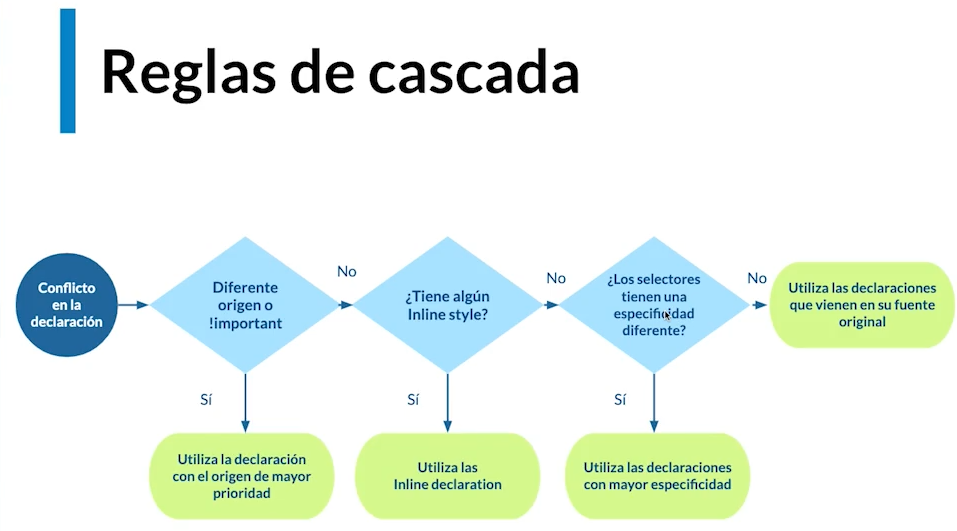

# Especificidad en selectores

Para terminar de entender el tema de la herencia es importante entender el orden de la declaracion y la especificidad que tiene css.

 
 

¿Cómo se controla el orden al declarar CSS?

 

1. **Importancia**: este es uno de los temas mas importantes, valga la redundacia. Si dos declaraciones tienen la misma importancia, la especificidad de las reglas decidirá cuál se debe aplicar. Si las reglas tienen la misma especificidad, el orden de las fuentes controla el resultado.
   1. Hoja de estilos de agente de usuario (Estilos del navegador)
   2. Declaraciones normales en hojas de estilo de autor (Nuestro .css)
   3. Declaraciones importantes en hojas de estilos de autor (utilizar el !important).    
   
    
    

2. **Especificidad**
   
     

    | Selectores | Especificidad | Importancia* | Símbolo* |
    | :---: | :---: | :---: | :---: |
    | !important | 1,0,0,0,0 | Más importante | +++
    | inline styles | 0,1,0,0,0 | Muy importante |++
    | #id | 0,0,1,0,0 | Importante | +
    | .class | 0,0,0,1,0 | No tan importante |-
    | tag | 0,0,0,0,1 | menos importante | --
   
    
   * Esto ya es de mi cosecha, para poder diferenciar
    
     

    

     
     

3. **Orden de fuentes**: Es la forma en que nosotros mandamos llamar los estilos, precisamente como una cascada, los primeros estilos pueden ser reescritos por los estilos mas abajo, dependiendo la especificidad.
   
 
 

> NOTA: No nos conviene tener tantos IDs para estilizar nuestro proyecto
