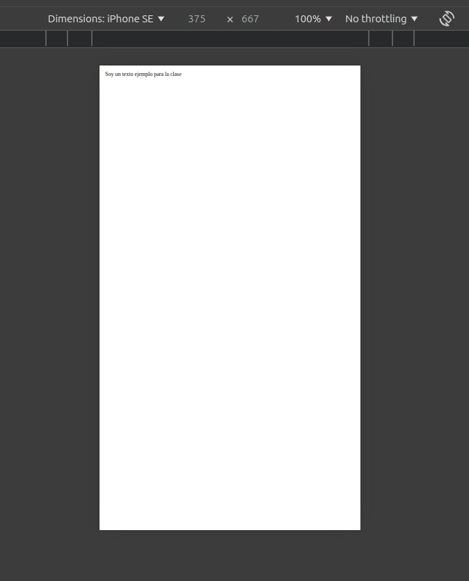
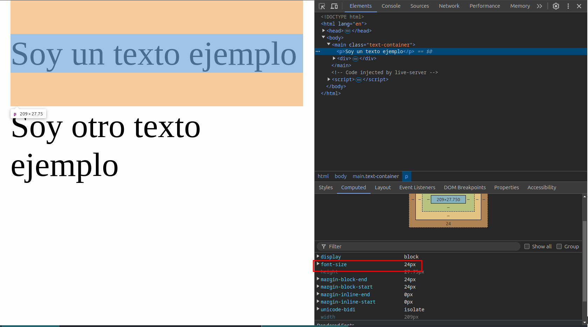
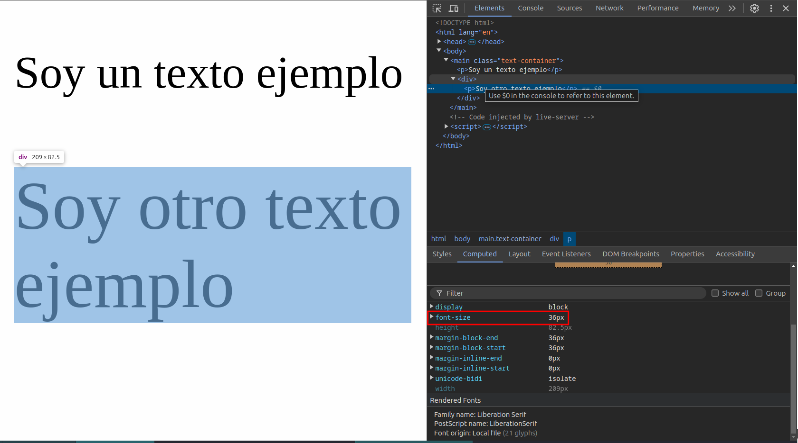
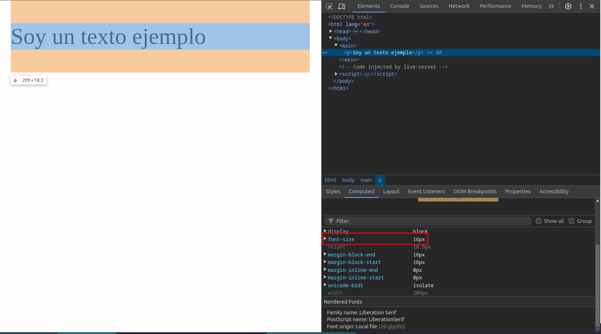
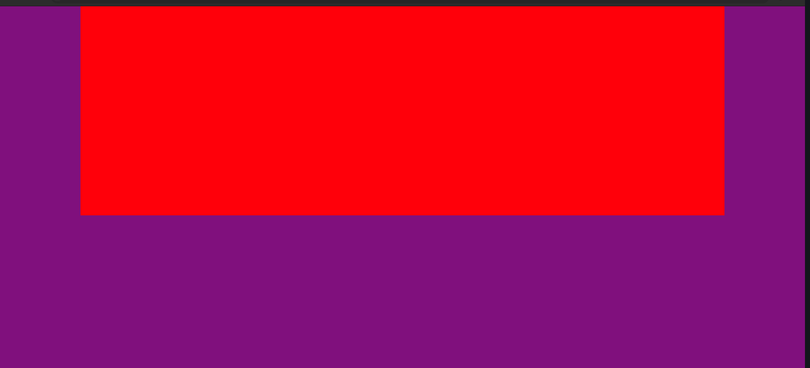
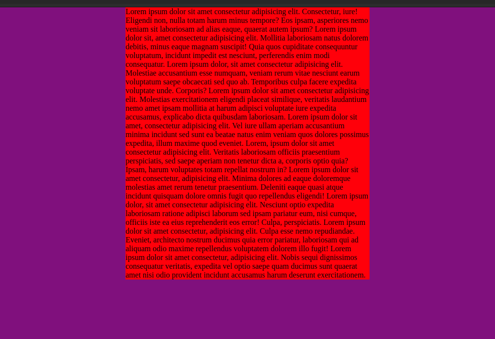

# Unidades de Medida

Existen dos parámetros que tenemos que aprender:

- **Medidas Absolutas.**
- **Medidas Relativas**
  
  - Porcentaje `%`
  - Elemento `em`
  - Elemento Raíz `rem [root em]` 
  - Max width / Max height `máximo ancho / alto`
  - Min width / Min height `mínimo ancho / alto`
  - Viewport Width `vw`
  - Viewport Height `vh`

<br>
<br>

## Medidas Absolutas

Estas medidas no cambian sin importar el tamaño de la pantalla en donde estemos viendo el proyecto, como los pixeles `px`:

```css
p {
         font-size: 18px;
      }
```
```html
<main>
      <p>Soy un texto ejemplo para la clase</p>
</main>
```

  
<br>
<br>

## Medidas Relativas

Estas medidas si cambian con respecto al tamaño de pantalla

<br>

### Porcentaje `%`

```css
p {
         font-size: 50%;
      }
```
```html
<main>
      <p>Soy un texto ejemplo para la clase</p>
</main>
```

<br>

El tamaño de la fuente es del 50% de 16px heredado por html, el cual es el tamaño predeterminado, ya que, recordemos, es el tamaño de fuente que nos aplica el navegador cuando nosotros no aplicamos un estilo.

  
<br>

#### En ancho y largo de un div

Aquí solo sería con width al 100%:
```css
main {
         background-color: red;
         width: 100%;
         height: 200px;

      }
p {
         font-size: 50%;
      }
```
```html
<main>
      <p>Soy un texto ejemplo para la clase</p>
</main>
```

<br>
El tamaño del div se ajusta al tamaño de la pantalla:


<br>

Aquí ajustamos ancho y alto con medidas absolutas (px):
```css
main {
         background-color: red;
         width: 600px;
         height: 400px;

      }
p {
         font-size: 50%;
      }
```
```html
<main>
      <p>Soy un texto ejemplo para la clase</p>
   </main>
```

<br>

En está regla nos aparece un problema de diseño denominado overflow, el cual es provocado por las medidas absolutas, y que provoca que no ajusten los elementos al tamaño de la pantalla, generando un scroll, esto es una muy mala práctica.


<br>
<br>

### Element `em`
Toma el tamaño que tenga el padre directo.

```css
.text-container {
         font-size: 1.5em; /* Aquí este elemento esta tomando el tamaño 1 y 1/2 del tamaño original (16px pro defecto 
         de html ya que no se ha configurado ninguna otro tamaño de fuente en elementos padres) 
         dando como resultado 24px (1.5 * 16 = 24) */ 
      }
```
```html
<main class="text-container">
      <p>Soy un texto ejemplo</p>
      <div>
         <p>Soy otro texto ejemplo</p>
      </div>
   </main>
```

<br>



<br>
<br>

Em puede significar un problema si no sabemos bien desde donde estamos llamando la propiedad.

<br>

En este otro ejemplo vemos lo confuso que puede llegar a ser utilizar esta medida.
```css
/* El tamaño de fuente por defecto en este ejemplo es de 16px */
.text-container {
         font-size: 1.5em; /* Toma el tamaño de 16px * 1.5 = 24px */
         }
.text-container div {
         font-size: 1.5em; /* Toma 24px como si fuera 1em, 24px * 1.5 = 36px
}
```
```html
<main class="text-container">
      <p>Soy un texto ejemplo</p>
      <div>
         <p>Soy otro texto ejemplo</p>
      </div>
   </main>
```

<br>

La clase text-container toma 1.5 el tamaño original de 16px y se trasforman en 24px.  
Después el div contenido en text-container tomará esos 24px como 1em por lo que lo multiplicara por el 1.5em declarado en la regla, dando como resultado 36px de tamaño de fuente.



<br>
<br>

### Root element `rem`

Toma la medida del padre raíz, es decir el padre más alto en la jerarquía del documento, que es el tag html y que tiene el tamaño de fuente de 16px por defecto.

Pero esto puede ser un poco engorroso a la hora hacer los cálculos a la hora de utilizarlo, por lo cual podremos declarar la siguiente regla css:

```css
html {
   font-size: 62.5%;
}
```
Esto es debido a que, el 62.5% de 16px es igual a 10px, con una base de tamaño de fuente de 10px, es mas fácil hacer los cálculos para poder modificar el tamaño de otros elementos.

<br>

```css
html {
   font-size: 62.5%;
}
p {
   font-size: 1.6rem;
}
main div {
   font-size: 1.6rem;
}
```

```html
<main>
      <p>Soy un texto ejemplo</p>
</main>
```

<br>




<br>
<br>

> ***NOTA MUY IMPORTANTE***: Al comenzar una nuevo documento .html, debemos de agregar al principio en docuemento de estilo .css las reglas de reset y conversión de tamaño de letra:
```css
html {
   font-size: 62.5%; /* Para llevar el tamaño de fuente a 10px */
}
body { 
   box-sizing: border-box;
   margin: 0;
   padding: 0;
}
```

<br>
<br>

### View width, View height y Max/Min Width

```css
* {
   box-sizing: border-box;
   margin: 0;
   padding 0;
}
html {
   font-size: 62.5%;
}
main {
   width: 100vw;
   height: 100vh;
   background-color: purple;
}
section {
   width: 80%;
   height: 500px;
   background-color: red;
   margin: 0 auto;
}
```
```html
<main>
   <section>

   </section>
</main>
```

> ***REGLA IMPORTANTE***: Cuando vayamos a utilizar el min/max en width debemos utilizar un width base y generalmente debe de estar en porcentaje



<br>
<br>

```css
* {
   box-sizing: border-box;
   margin: 0;
   padding 0;
}
main {
   width: 100vw;
   height: 100vh;
   background-color: purple;
}
section {
   width: 80%;
   min-width: 320px;
   max-width: 500px;
   min-height: 500px;
   background-color: red;
   margin: 0 auto;
}
```
```html
<main>
   <section>
      <p>
         Lorem ipsum...
      </p>
   </section>
</main>
```

